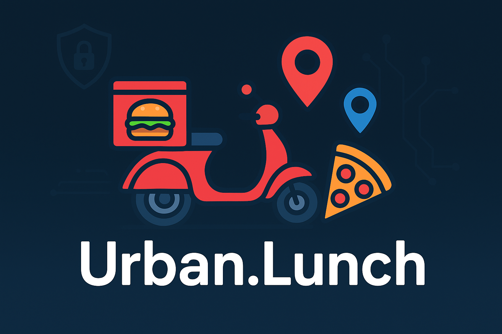
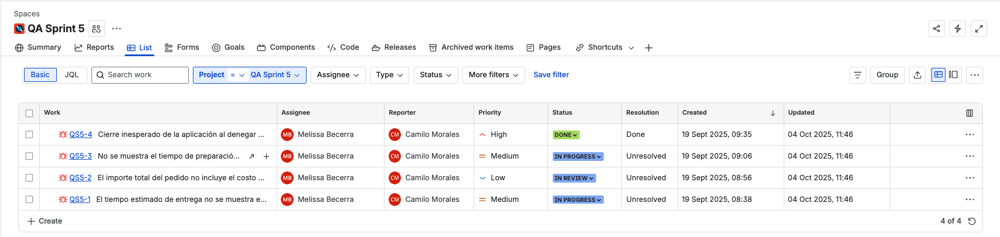
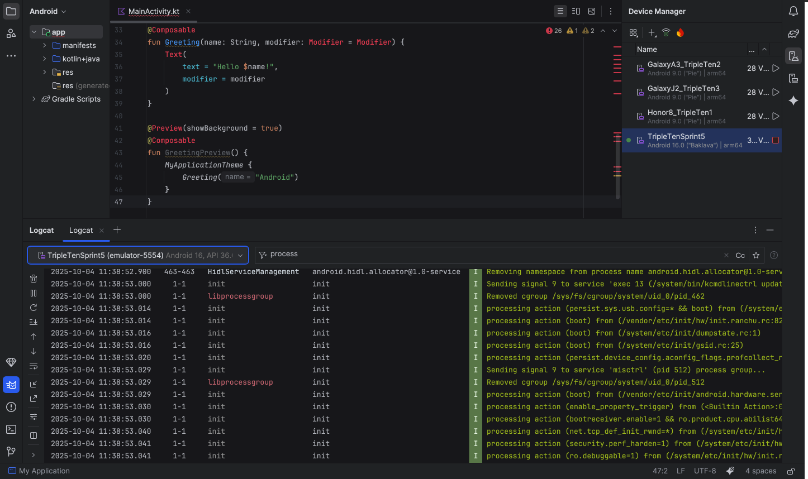
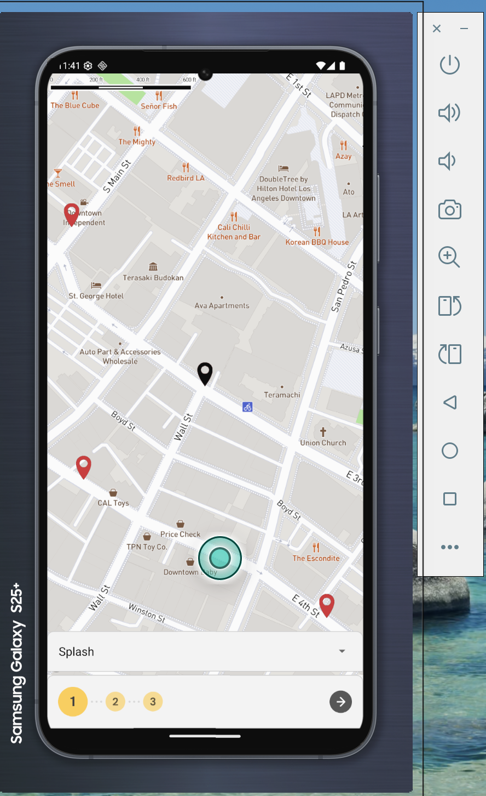
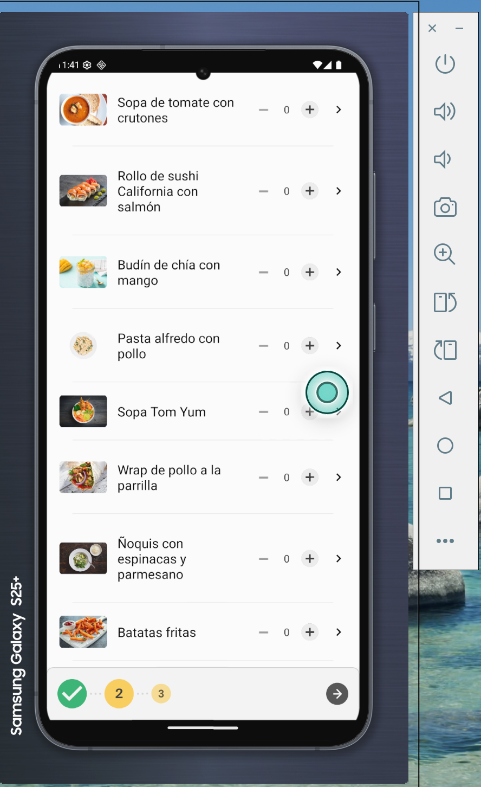

<!-- ===== HEADER BANNER ===== -->

  

# 
Urban.Lunch  Mobile App

  <!-- Badges -->
  
  
  

## Overview
**Urban.Lunch** is an Android mobile app that lets users order food from multiple restaurants and pick a single pickup location where all orders are collected.  
This repo documents my QA testing for **Urban.Lunch v1.0**, including test approach, results, defects, and evidence.

## Project Goal
Validate core user flows so that a user can:
- Choose a pick-up point,
- Select dishes from multiple restaurants,
- Confirm an order (with correct totals),
- Track the order status,
- And verify correct handling of geolocation permissions and error messages.

## Approach
- **Emulator:** Android Studio — used Samsung Galaxy S25+ profile (Android 16.0)  
- **Type of testing:** Manual testing (exploratory + scripted) on emulator; log inspection via Logcat.  
- **Test coverage:** Positive, negative and boundary scenarios (e.g., multiple restaurants, max items).  

## Key Results
- **Defects found:** 3 functional defects affecting order confirmation and tracking.  
- **Permissions issue:** Unexpected app behavior when geolocation permissions are denied (app may close or block flow).  
- **Other notes:** Total amount calculation does not include delivery fee correctly.

## Recommendations
1. Fix total cost calculation so `delivery cost` is included in `order total`.  
2. Add estimated delivery time and a preparation timer in the UI.  
3. Define expected behavior when geolocation permission is denied (do not close app; allow retry or redirect to settings).  
4. Re-execute the test suite after fixes and update the test evidence.

## Tools & Skills

## Test Evidence
### Bugs Reported (JIRA) 

### Android Studio - Logcat 

### Urban.Lunch Mobile App

  
  

